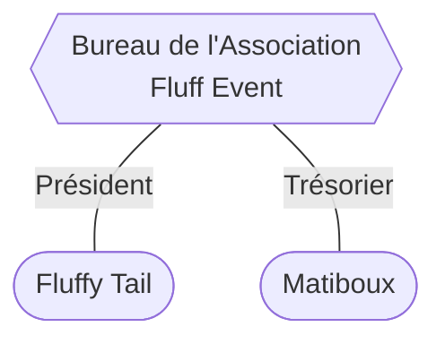

# Bureau de l'Association "Fluff Event"

_Mis à jour le 19 août 2024._

Le Bureau est l'organe exécutif administratif de l'Association "Fluff Event".

---

---

**Situation au 19 août 2024**

Suite à l'Assemblée Générale Ordinaire du 18 août 2024, la composition du Bureau est la suivante :

\- **Fluffy Tail**, membre élu le 18 août 2024 par l'Assemblée Générale à la fonction de **Président**.

\- **Matiboux**, membre élu le 18 août 2024 par l'Assemblée Générale à la fonction de **Trésorier**.

---

**Situation au 5 avril 2023** (obsolète)

Suite à l'Assemblée Générale Constitutive précédant la création de l'Association le 5 avril 2023, la composition du Bureau est la suivante :

\- **Fluffy Tail**, membre élu le 5 avril 2023 à la fonction de **Président** (mandat renouvelé le 18 août 2024).

\- **Phil**, membre élu le 5 avril 2023 à la fonction de **Trésorier** (mandat interrompu au 18 août 2024).
