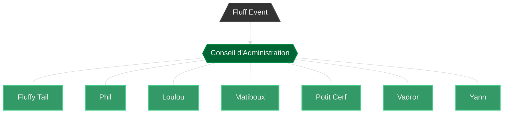

# Conseil d'Administration de l’Association “Fluff Event“

_Mis à jour le 18 août 2024._

Le Conseil d'Administration est l'organe décisionnel administratif de l'Association "Fluff Event".

---

---

**Situation au 18 août 2024**

Suite à l’Assemblée Générale Ordinaire du 18 août 2024, les membres du Conseil d'Administration sont :

\- **Fluffy Tail**, membre élu le 5 avril 2023, renouvelé le 18 août 2024, mandaté jusqu'au 18 août 2026.

\- **Phil**, membre élu le 5 avril 2023, mandaté jusqu'au 5 avril 2025.

\- **Loulou**, membre élu le 18 août 2024, mandaté jusqu'au 18 août 2026.

\- **Matiboux**, membre élu le 18 août 2024, mandaté jusqu'au 18 août 2026.

\- **Potit Cerf**, membre élu le 18 août 2024, mandaté jusqu'au 18 août 2026.

\- **Vadror**, membre élu le 18 août 2024, mandaté jusqu'au 18 août 2026.

\- **Yann**, membre élu le 18 août 2024, mandaté jusqu'au 18 août 2026.
