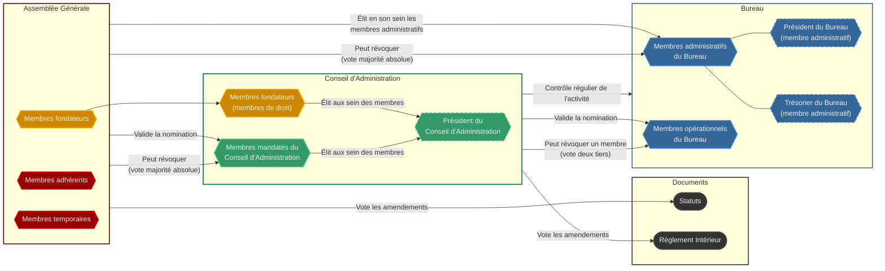

# Diagramme des instances de l'Association

```mermaid
graph LR

AG{{"Assemblée Générale"}}
AGF{{"Membres fondateurs"}}
AGA{{"Membres adhérents"}}
AGT{{"Membres temporaires"}}

BU{{"Bureau"}}
BUA{{"Membres administratifs<br>du Bureau"}}
BUP{{"Président du Bureau<br>(membre administratif)"}}
BUT{{"Trésorier du Bureau<br>(membre administratif)"}}
BUM{{"Membres opérationnels<br>du Bureau"}}

CA{{"Conseil d'Administration"}}
CAP{{"Président du<br>Conseil d'Administration"}}
CAF{{"Membres fondateurs<br>(membres de droit)"}}
CAM{{"Membres mandatés du<br>Conseil d'Administration"}}

Statuts([Statuts])
Reglement([Règlement Intérieur])

subgraph AG[Assemblée Générale]
  AGF
  AGA
  AGT
end

subgraph Docs[Documents]
  Statuts
  Reglement
end

subgraph BU[Bureau]
  BUA
  BUP
  BUT
  BUM
end

subgraph CA[Conseil d'Administration]
  CAP
  CAF
  CAM
end

AGF --> CAF

AG -->|"Élit en son sein les<br>membres administratifs"| BUA
AG -->|"Peut révoquer<br>(vote majorité absolue)"| BUA

BUA --- BUP
BUA --- BUT
 
AG -->|"Valide la nomination"| CAM
AG -->|"Peut révoquer<br>(vote majorité absolue)"| CAM

CAF -->|"Élit aux sein des membres"| CAP
CAM -->|"Élit aux sein des membres"| CAP

CA -->|"Contrôle régulier de l'activité"| BU
CA -->|"Valide la nomination"| BUM
CA -->|"Peut révoquer un membre<br>(vote deux tiers)"| BUM

AG -->|"Vote les amendements"| Statuts
CA -->|"Vote les amendements"| Reglement

style AG stroke:#600,stroke-width:2px
style AGF fill:#c80,color:#eee,stroke:#fa0,stroke-width:2px
style AGA fill:#900,color:#eee,stroke:#c00,stroke-width:2px
style AGT fill:#900,color:#eee,stroke:#c00,stroke-width:2px

style BU stroke:#369,stroke-width:2px
style BUA fill:#369,color:#eee,stroke:#48c,stroke-width:2px
style BUP fill:#369,color:#eee,stroke:#48c,stroke-width:2px,stroke-dasharray: 5 5
style BUT fill:#369,color:#eee,stroke:#48c,stroke-width:2px,stroke-dasharray: 5 5
style BUM fill:#369,color:#eee,stroke:#48c,stroke-width:2px

style CA stroke:#063,stroke-width:2px
style CAP fill:#396,color:#eee,stroke:#4c8,stroke-width:2px,stroke-dasharray: 5 5
style CAF fill:#c80,color:#eee,stroke:#fa0,stroke-width:2px
style CAM fill:#396,color:#eee,stroke:#4c8,stroke-width:2px

style Docs stroke:#333,stroke-width:2px
style Statuts fill:#333,color:#eee,stroke:#444,stroke-width:2px
style Reglement fill:#333,color:#eee,stroke:#444,stroke-width:2px
```
